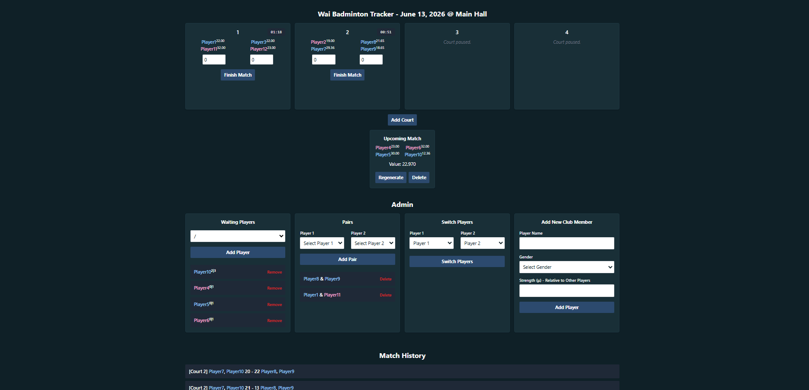

# Wai-Badminton-Tracker

<strong>WBT</strong> is a lightweight web application focused primarily on managing sessions for your badminton club via an intuitive powerful central dashboard. Built primarily using <strong>HTML</strong>, <strong>Django</strong>, and <strong>HTMX</strong>.

| Feature | eBadders | SuperBadders | **WBT** |
|---|---|---|---|
| Court management | ✅ | ✅ | ✅ |
| Automatic player matching | ✅ | ✅ | ✅ |
| Transparent matchmaking algorithm | ❌ | ⚠️ | ✅ |
| Adjustable matchmaking weights | ❌ | ✅ | ⚠️ |
| Switch players in match | ✅ | ❌ | ✅ |
| Non-admins can view session | ❌ | ❌ | ✅ |
| Adjust player strength | ❌ | ⚠️ | ✅ |
| Allow player pairings | ✅ | ⚠️ | ✅ |
| Multiple device support | ✅ | ❌ | ✅ |
| Offline mode | ❌ | ⚠️ | ❌ |
| Handles session gender imbalance | ❌ | ✅ | ✅ |
| Modern web interface | ✅ | ❌ | ✅ |
| Session summary | ✅ | ❌ | TBA |
| Control over your own data | ❌ | ✅ | ✅ |
| Import from other systems | ❌ | ❌ | ✅ |
| **Open Source** | ❌ | ❌ | ✅ |

## Getting Started

#### Deployment
See [DEPLOYMENT](DEPLOYMENT.md)

#### Import Players
Admins can import players from ebadders/ using the endpoints `{URL}/import-players/ebadders/` or `{URL}/import-players/superbadders/`

##### Ebadders
Under `https://ebadders.com/{YOUR_CLUB_NAME}/players?o=name` on Google Chrome, ctrl + S, Save as type `Web Page, HTML Only` and upload it to  `{URL}/import-players/ebadders/`

##### Superbadders
Under `https://www.superbadders.com/myplayers.php` > Backup/Export > , Copy to Clipboard and paste the string into  `{URL}/import-players/superbadders/`

 

## Contributing

Thank you for considering contributing! See [CONTRIBUTING](CONTRIBUTING.md)

## License

Licensed under the **PolyForm Noncommercial License 1.0.0**.  
See [LICENSE](LICENSE) for details.

**This software is for non-commercial use only.**

